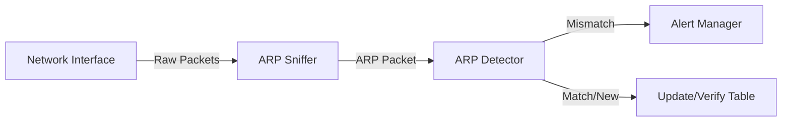

# System Architecture

The ARP Spoof Detection tool is built using a modular architecture to separate packet capture, analysis, and alerting responsibilities.

## Components

### 1. Entry Point (`src/main.py`)
- **Responsibility**: Initializes the application and handles the main execution loop.
- **Function**: Catches `KeyboardInterrupt` for graceful shutdown and invokes the sniffing module.

### 2. ARP Sniffer (`src/arp_sniffer.py`)
- **Responsibility**: Interfaces with the network card.
- **Library**: Uses `scapy` to sniff network traffic.
- **Filter**: Applies a filter to capture only ARP packets (`filter="arp"`).
- **Action**: Forwards every captured packet to the `detect_arp_spoof` callback function.

### 3. ARP Detector (`src/arp_detector.py`)
- **Responsibility**: Core security logic.
- **State Management**: Maintains a runtime dictionary (`arp_table`) mapping IP addresses to MAC addresses.
- **Logic**:
    - Checks if the packet is an ARP reply (Opcode 2).
    - Compares the Source IP and Source MAC against the `arp_table`.
    - Identifies discrepancies (Spoofing) or new devices (Learning).

### 4. Alert Manager (`src/alert_manager.py`)
- **Responsibility**: Reporting and Logging.
- **Console**: Prints formatted alerts to standard output.
- **File System**: Appends alerts and informational logs to `logs/alerts.log`.
- **Utils**: Handles directory creation if the log folder does not exist.

### 5. Configuration (`config/settings.py`)
- **Responsibility**: Centralized configuration.
- **Variables**: Stores `INTERFACE`, `GATEWAY_IP`, `GATEWAY_MAC`, and `ALERT_LOG` paths.

## Data Flow Diagram

